# 개발 기록 — 무엇을 왜 바꿨나

이 폴더는 **결과물이 아니라 과정**을 남긴다.

과제 평가 기준은 완성도가 아니라 **문제정의 → 가설 → 제작 → 데이터 검증 → 재가설**을 반복한
과정이다. 완성된 화면만 보면 그 반복이 보이지 않는다. 그래서 "무엇을 만들었나"가 아니라
**"무엇이 틀렸다는 걸 알고 무엇을 바꿨나"**를 시간 순으로 적는다.

- 주 단위 수치 검증은 [`docs/experiments/`](../experiments/README.md)에 따로 쌓는다.
  이 문서는 그보다 앞선 단계 — **피드백과 발견으로 방향을 바꾼 지점**을 다룬다.
- 화면은 [`images/`](images)에 있다. `scripts/capture-journey.ts`로 찍으므로
  같은 뷰포트·같은 체형·같은 경로가 보장된다. 손으로 캡처하면 매번 조건이 달라져
  before/after를 나란히 놓을 수 없다.

```bash
npm run dev
npx dotenv -e .env.local -- tsx scripts/capture-journey.ts <라벨>
```

---

## 0. 출발점 — 문제 정의

**아이디어를 다섯 개 놓고 골랐다.**

| 후보 | 접은 이유 |
|---|---|
| 지하철역 천원빵 지도 | 데이터를 채울 방법이 없었다 |
| 지하철 화장실 위치(출구·층) | 공공데이터가 있어 실현 가능했지만, 이미 같은 서비스가 있었다 |
| 동네가게 vs 대형마트 가격 비교 | 가격 데이터를 계속 채워 넣는 것이 서비스 자체보다 큰 문제였다 |
| 목욕탕 가격·후기 | 네이버플레이스와 정면으로 겹쳤다 |
| **온라인 데님 사이즈 핏 정보** | **선택** |

고른 기준은 "만들기 쉬운가"가 아니라 **"우리가 실제로 겪은 문제인가"**였다.
토스·야놀자·오늘의집이 전부 창업자 본인이 겪은 불편에서 출발했다는 실습1의 사례를 따랐다.

**문제**: 온라인으로 청바지를 살 때 브랜드 사이즈표는 "평균 체형" 기준이라,
같은 32인치여도 골반·허벅지 비율이 다르면 결과가 갈린다. 매장에 가서 입어보든
샀다가 반품하든 결국 시간을 쓴다.

**핵심 가설**: 체형 수치로 후기를 정렬해 보여주면 공식 사이즈표보다 사이즈 결정에 도움이 된다.

**이때 세운 가장 큰 리스크**: *사람들이 자기 몸 정보를 입력해줄까?* → 그래서 H1이 됐다.

---

## 1차 — 팀 피드백 반영

> **받은 피드백 (3건)**
> 1. 성별 구분이 없어서 체형 분포가 너무 넓다
> 2. 501·517 두 모델뿐이다
> 3. 최신순 말고 나와 비슷한 체형 순으로 먼저 보여달라

### 무엇이 문제였나

| | 이전 | 이후 |
|---|---|---|
| 모델 | 501·517 **2개** | **12개** (슬림·스트레이트·테이퍼드·부츠컷·릴랙스드) |
| 성별 | 구분 없음 | 같은 성별끼리만 비교 (표본 부족하면 자동 해제) |
| 정렬 | — | 이미 유사도 순이었다. 체형 입력 전에는 최신순으로 보이는 게 원인이었다 |

<table>
<tr><th width="50%">이전</th><th width="50%">이후</th></tr>
<tr>
<td>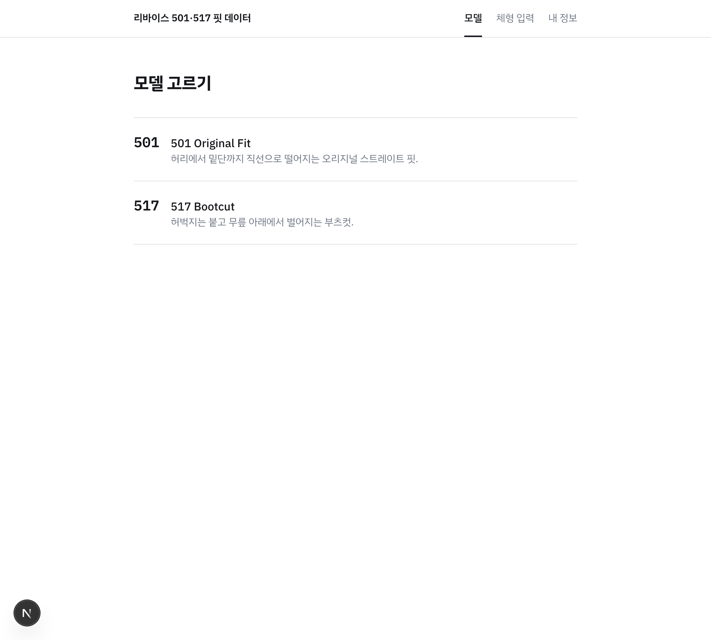</td>
<td>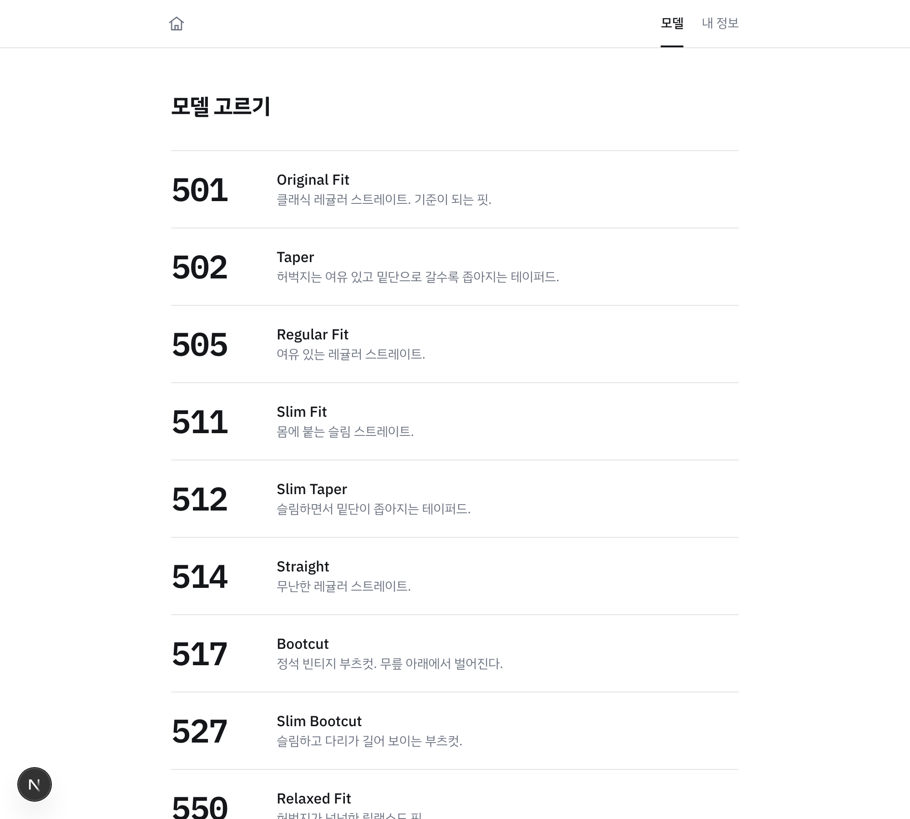</td>
</tr>
</table>

### 판단이 갈린 지점 — 성별을 어디에 쓸 것인가

유사도 계산에 성별을 넣을지 논의했고 **넣지 않기로 했다.**
성별은 치수가 아니라 범주다. 키 177cm와 175cm의 거리는 2cm로 잴 수 있지만
"남성과 여성의 거리"에는 그런 값이 없다. 대신 **비교 대상을 거르는 필터**로 쓴다.

같은 성별 후기가 5건 미만이면 필터를 자동으로 풀고 **그 사실을 화면에 적는다.**
숨기면 사용자는 왜 유사도가 낮은지 알 수 없다.

### 3번은 피드백이 틀렸다

이미 유사도 순으로 정렬하고 있었다. 다만 **체형을 입력하기 전에는 최신순**이라
그렇게 보였던 것이다. 기능을 만드는 대신 화면에 안내 문구를 두는 것으로 끝났다.

> **배운 것**: 피드백은 증상이지 진단이 아니다. "정렬이 이상하다"는 말을 그대로 받아
> 정렬 코드를 고쳤다면 멀쩡한 로직을 망가뜨렸을 것이다.

---

## 2차 — 계측이 꺼져 있었다는 발견

### 무엇이 문제였나

**GA가 한 번도 붙어 있지 않았다.** 배포된 HTML을 받아보니 `gtag` 스크립트가 아예 없었다.

원인은 두 개가 겹쳤다.

1. `deploy.yml`이 `NEXT_PUBLIC_GA_ID`를 빌드에 넘기지 않았다
2. 코드는 측정 ID가 없으면 **조용히** GA를 끄게 되어 있었다 (`app/layout.tsx`)

조용히 꺼졌기 때문에 아무도 몰랐다.

이게 심각했던 이유는, `docs/experiments/`에 H1~H4를 GA4 이벤트로 측정한다고 **정의해두고
있었기 때문**이다. 측정 계획은 문서에 있는데 측정기가 꺼져 있었다.
**그때까지 쌓인 데이터가 0이었다.**

### 무엇을 바꿨나

- 측정 ID를 `lib/brand.ts`에 뒀다. 모든 페이지 HTML에 실려 나가는 공개 값이라
  숨겨서 얻을 게 없고, 저장소 변수는 admin만 만들 수 있는데 팀원 대부분은 collaborator다
- **로컬 개발 트래픽은 제외**했다. 프로덕션 빌드에서만 켜진다.
  `npm run dev`로 스무 번 돌아다녀도 H1 전환율이 오염되지 않는다
- **배포 전에 산출물 HTML에 GA 태그가 있는지 확인하고, 없으면 배포를 실패시킨다.**
  조용히 넘어가는 것이 애초에 이 문제를 만들었다

### 검사 코드를 처음에 틀렸다

`googletagmanager` 문자열을 찾도록 짰는데, 그 문자열이 `@next/third-parties` 번들에
**항상** 들어 있어서 GA가 꺼져 있어도 통과했다. 측정 ID 있음/없음 두 경우로 직접
빌드해보다가 발견해서, HTML만 훑도록 고쳤다.

> **배운 것**: "검사를 넣었다"와 "검사가 동작한다"는 다르다.
> 실패해야 하는 경우를 만들어 실제로 실패하는 것을 봐야 검사다.

### 같은 작업에서 정리한 화면

디자인 시스템은 [awesome-design-md](https://github.com/voltagent/awesome-design-md)의
Nike DESIGN.md를 참고했다. 가져온 것은 **"극단적 타이포 대비"** 하나다 —
큰 디스플레이 티어와 조용한 16px UI만 두고 중간 단계를 없애면 위는 간판, 아래는 표로 읽힌다.

<table>
<tr><th width="50%">이전</th><th width="50%">이후</th></tr>
<tr>
<td>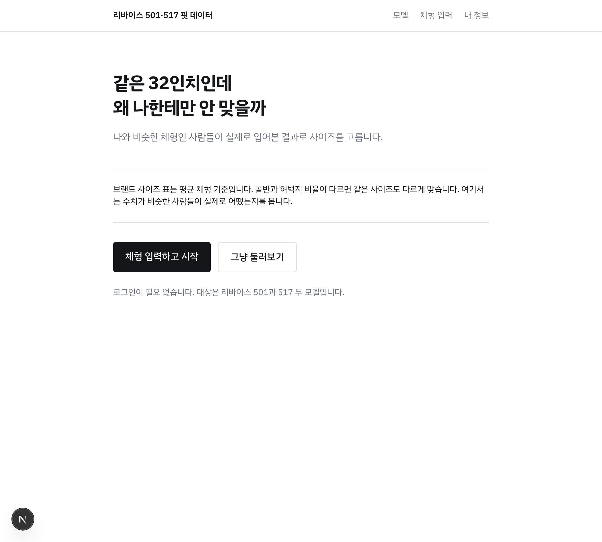</td>
<td>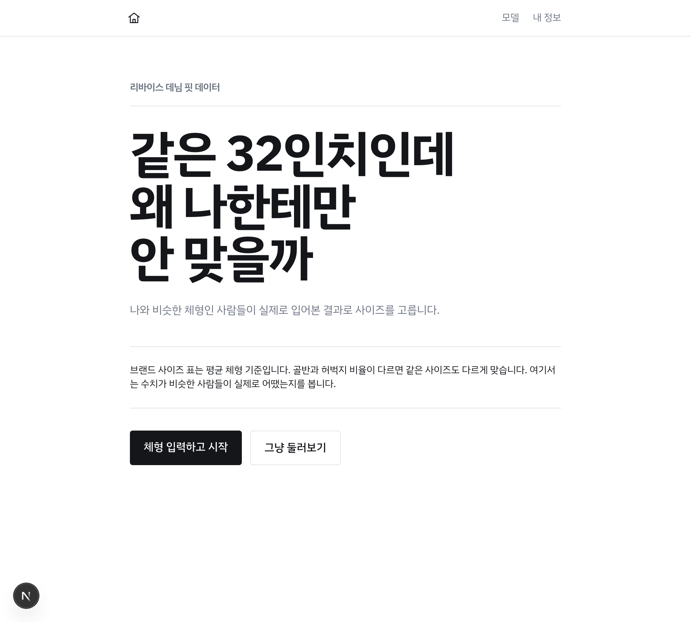</td>
</tr>
</table>

**알약 버튼은 가져오지 않았다.** Nike의 CTA 어휘는 전부 `rounded-full`이지만,
우리 브랜드 가이드는 `rounded-sm`만 허용하고 `lib/design/forbidden.test.ts`가
CI에서 이를 강제한다. 팀이 의도적으로 세운 규칙이라 뒤집는 대신 타이포만 취했다.

같이 걷어낸 것:

- **눌리지 않는 `구글/카카오 계정 연결` 버튼** — 없는 기능을 비활성 버튼으로 세워두고
  "준비 중"이라 적는 대신, 익명 세션의 한계만 사실대로 적었다
- **서비스명의 `(가칭)`** — 내부 메모인데 탭 제목과 검색 결과로 그대로 나가고 있었다
- **`대상은 리바이스 501과 517 두 모델입니다`** — 12종 확대 후에도 남아 있던 실제 오류

### 결과

배포본에서 직접 확인한 것:

```bash
$ curl -s https://ccccmkk.github.io/team5/ | grep -o "gtag/js?id=G-[A-Za-z0-9]*"
gtag/js?id=G-SYK7MN1BHR
```

그리고 GA에 실제로 접속이 잡혔다. **이 시점부터 데이터가 쌓이기 시작했다.**

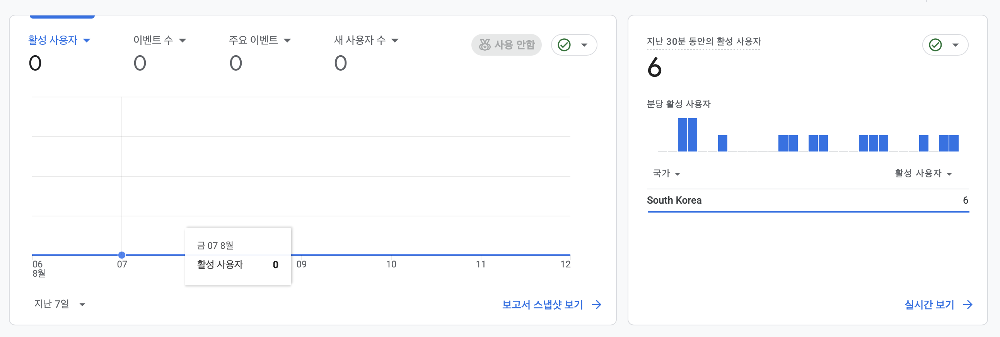

이 한 장이 두 가지를 동시에 말한다.

- **왼쪽 `지난 7일 = 0`** — 외부에 뿌리기 전 기준선. 이 값이 있어야 나중에
  "에브리타임·인스타에 공유한 것이 효과가 있었나"를 말할 수 있다
- **오른쪽 `지난 30분 = 6`** — 계측이 실제로 돌고 있다는 증거.
  왼쪽이 0인 것은 GA가 고장나서가 아니라 진짜 사람이 없어서다

> **숫자를 정확히 읽어야 한다.** `지난 7일 = 0`은 "방문자가 0명"이 아니다.
> GA는 집계에 하루 이상 걸려서, 찍은 시점의 접속(오른쪽 6명)은 아직 왼쪽 그래프에
> 반영되지 않았다. 정확히는 **"외부 유입 0, 그때까지 접속은 팀 내부 테스트뿐"**이다.
> 검증 기록에 "0명이었다"고만 적으면 나중에 본인도 읽는 사람도 오해한다.

---

## 3차 — 얇은 표본으로 단정하고 있었다

### 무엇이 문제였나

추천 로직에 유사도 하한(`MIN_SIMILARITY`)은 있는데 **최소 인원 기준이 없었다.**

- 후보가 **한 명**만 통과해도 사이즈를 추천했다
- 지지자가 둘일 때 하나가 지적하면 50%라 경고 기준(30%)을 그냥 넘었다
  → 화면에 **`엉덩이 많이 낌 1/2`** 같은 경고가 떴다

2명 중 1명은 정보가 아니라 잡음이다. 그런데 화면에서는 단정적으로 보인다.

<table>
<tr><th width="50%">이전 — 잡음 경고 2개, 형광 배지</th><th width="50%">이후 — 경고 없음, 무신사 링크</th></tr>
<tr>
<td>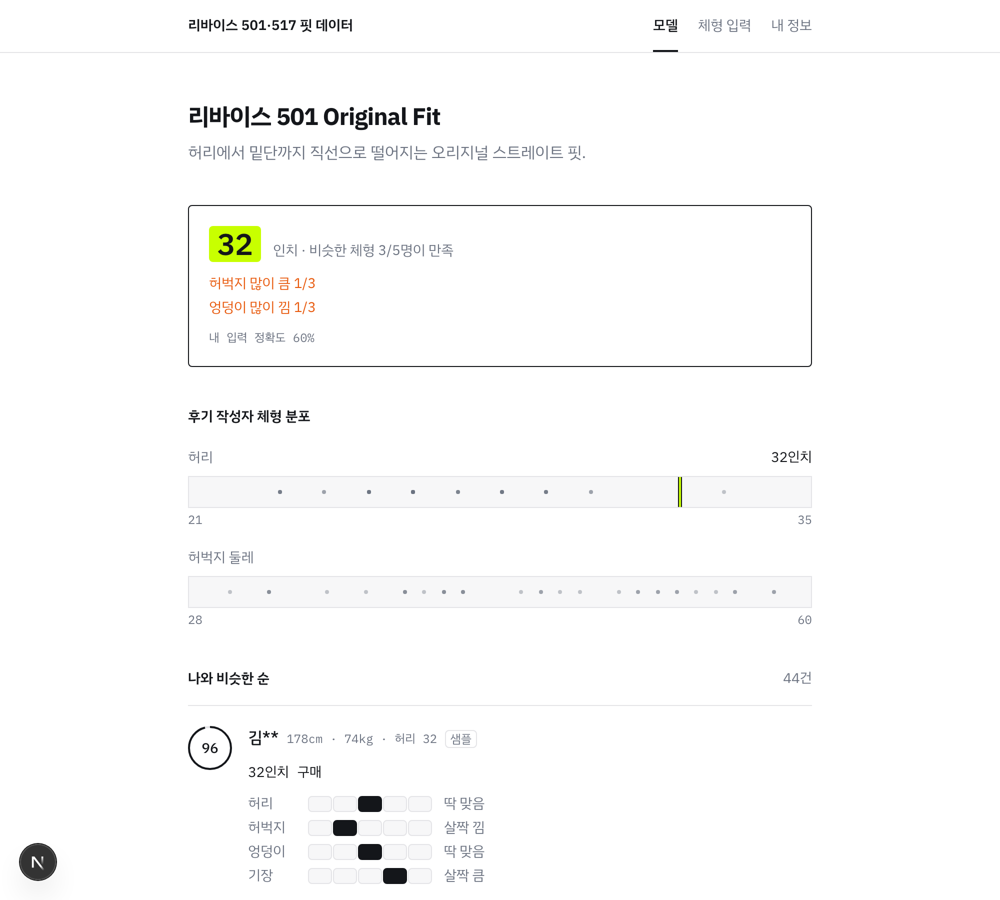</td>
<td>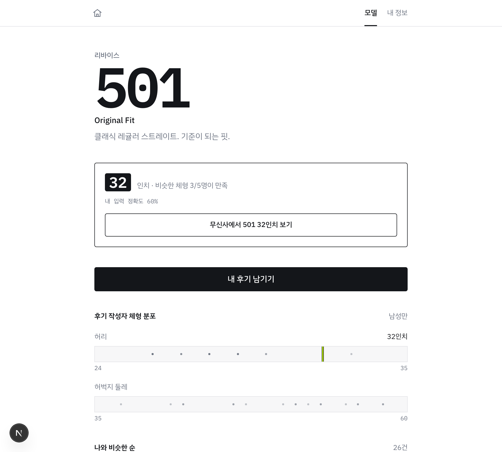</td>
</tr>
</table>

### 임계값을 감으로 정하지 않았다

실제 시드 605건으로 **체형 87개 × 모델 12개 = 1,044건**을 시뮬레이션했다.

| 최소 지지자 | 추천이 나오는 비율 |
|---|---|
| 1명 (기존) | 94.9% |
| **2명 (선택)** | **72.7%** |
| 3명 | 45.8% |
| 4명 | 22.8% |

지지자 수 중앙값이 2명이었다. 3으로 올리면 **절반 이상이 추천을 못 받아** 서비스가
성립하지 않는다. 그래서 2로 뒀다. 후기가 쌓이면 올린다.

경고는 따로 조였다 — 지지자 3명 이상 **그리고** 2명 이상이 같은 말을 해야 띄운다.

> **배운 것**: "더 엄격하게"가 항상 옳지는 않다. 엄격함의 비용을 데이터로 재보니
> 3명은 서비스를 망가뜨리는 선택이었다.

### 같이 정리한 것

- **accent(형광) 색이 한 화면에 3번** 나왔다. 브랜드 가이드는 1~2회다.
  `MeasureBar`의 주석은 이미 *"accent는 여기서만 쓴다"*고 선언하고 있었으므로,
  **그 주석이 참이 되도록** 추천 배지를 검정 반전으로 바꿨다
- **시드 닉네임이 자동 생성 티가 났다.** `느긋한수달` 같은 형용사+동물 조합은
  49가지뿐이라 605건에서 심하게 반복됐다. 커머스 후기에서 실제로 보이는
  마스킹 아이디(`김**`, `hoon**71`)로 바꿔 고유값이 **49 → 276**이 됐다
- **사이즈표 출처를 사실대로 적었다.** levi.com이 자동 요청을 403으로 막아 공식 표를
  대조하지 못했다. 확인된 것은 기준표의 허리·엉덩이뿐이고 모델별 보정치는 추정이다.
  `CHECKED_AT`을 억지로 채우지 않고 무엇이 확인됐고 무엇이 추정인지 주석에 남겼다

---

## 4차 — 표본이 얇을 때 읽을 수 있는 지표 (H5)

> **받은 피드백**
> *"강의에서 조교님이 결혼식장 예매 사이트 링크 걸어두신 것처럼,
> 무신사 링크 걸어두고 그걸로 KPI 측정하는 건 어떨까요?"*

### 왜 이게 중요했나

이 시점에 이미 알고 있던 문제가 있었다. **초기 트래픽이 수십 명이면 H4(후기 작성
전환율)는 읽을 수가 없다.** 후기 작성은 허들이 높아 전환율이 낮은데, 분모가 20이면
한 명 차이로 5%p가 움직인다. 노이즈가 신호보다 크다.

**링크 클릭은 허들이 낮다.** "32인치 추천받았네 → 사러 가볼까"는 자연스러운 동작이라
같은 표본에서도 비율이 덜 흔들린다. 즉 **적은 트래픽에서 유일하게 읽을 만한 전환 지표**다.

동시에 **"추천을 믿었는가"의 대리 지표**이기도 하다. 사이즈를 보고 사러 나갔다는 것은
그 숫자를 신뢰했다는 뜻이다. 체류시간(H3)보다 직접적이다.

### 서비스 동선도 완성됐다

그전까지 서비스는 "32인치 사세요"에서 끝났고, 어디서 사는지는 사용자가 알아서
찾아야 했다. 실습1에서 CX를 *"고객의 움직임에 따라 기업이 해야 되는 행동까지 설계하는 것"*
이라고 했는데, 마지막 한 칸이 비어 있었던 것이다.

### 결정

- **목적지는 무신사.** 페르소나가 온라인으로 청바지를 사는 사람이고, 실제로 쓰는 곳이다.
  리바이스 공식몰은 모델 페이지가 정확하지만 가격대가 높아 이탈 위험이 있다
- **검색 결과로 보낸다.** 무신사에는 모델별 고정 상품 페이지가 없어, 특정 상품 URL을
  박아두면 금방 죽은 링크가 된다
- **추천 카드 안에 둔다.** 사이즈를 확인한 직후가 사러 가고 싶은 순간이다

**H5 = `outbound_click` / `view_recommendation`, 목표 25%**

---

## 모바일에서 본 지금

링크를 카톡·커뮤니티로 뿌리므로 대부분 폰에서 열린다. 데스크톱만 보고 판단하면
실제 사용자가 보는 화면을 못 본다.

<table>
<tr><th width="33%">홈</th><th width="33%">모델 고르기</th><th width="33%">추천 + 무신사</th></tr>
<tr>
<td>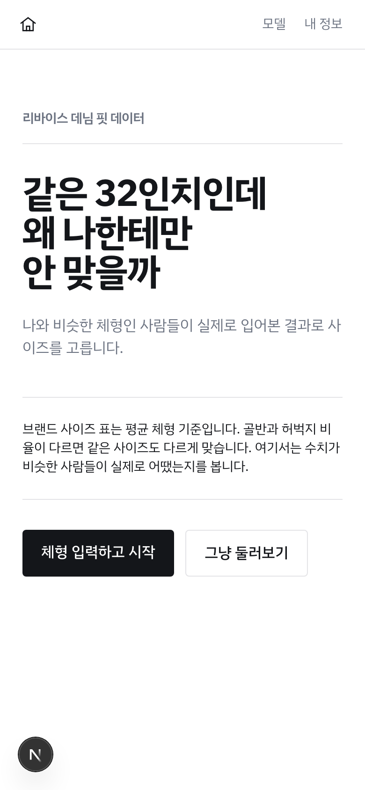</td>
<td>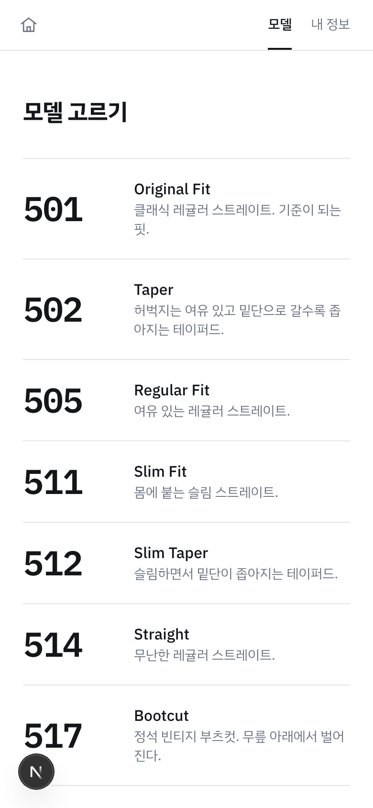</td>
<td>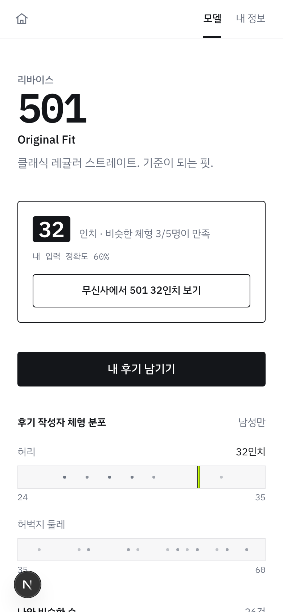</td>
</tr>
</table>

한글은 라틴 문자만큼 줄간을 좁히면 받침이 윗줄에 닿는다. 그래서 큰 제목은
`line-height: 1.05`로 두고, 디센더가 없는 **숫자 전용 티어만 0.85**로 따로 뒀다.

---

## 지금까지의 가설 목록

| # | 가설 | KPI | 목표 | 상태 |
|---|---|---|---|---|
| H1 | 사람들은 자기 몸 정보를 입력해준다 | `profile_complete` / `profile_start` | 60% | 측정 중 |
| H2 | 선택 항목까지 입력할 의향이 있다 | 선택 항목 1개 이상 입력률 | 30% | 측정 중 |
| H3 | 유사도 정렬이 실제로 도움이 된다 | 프로필 유/무 체류시간 | 유 > 무 | 측정 중 |
| H4 | 조회만 하지 않고 기여도 한다 | `review_submit` / 프로필 보유자 | 15% | 표본 부족 예상 |
| H5 | 추천을 신뢰해 구매로 넘어간다 | `outbound_click` / `view_recommendation` | 25% | 측정 중 |

---

## 5차 — 후기가 사라질 수 있다는 것을 알았다

### 처음 인식은 틀렸다

*"로그인을 안 하니까 사람들이 남긴 후기가 아까운 것 아니냐"*에서 출발했는데,
확인해보니 **후기 자체는 사라지지 않았다.** 익명이라도 Supabase에 실재하는
`auth.users` 행이 생기고, 후기는 그 `user_id`와 함께 DB에 영구 저장된다.
읽기는 전체 공개라 다른 사람에게는 계속 보인다.

없어지는 것은 **"내 후기를 내가 관리할 수 있는 권한"**이었다. 기기를 바꾸면
본인이 자기 후기를 못 찾는다.

### 그런데 진짜 위험은 다른 데 있었다

```sql
user_id uuid references auth.users(id) on delete cascade
```

**익명 계정이 정리되면 그 사람 후기가 통째로 같이 삭제된다.** Supabase는 오래된
익명 계정 정리를 권장하고 실제로 그렇게 운영하는 경우가 많다. 이게 로그인을
붙여야 할 진짜 이유였다.

> **배운 것**: 문제를 처음 말한 방식("후기가 아깝다")이 실제 문제("cascade로
> 지워질 수 있다")와 달랐다. 코드를 확인하지 않았으면 엉뚱한 것을 고쳤을 것이다.

### 해결 — 로그인 벽을 세우지 않고

`linkIdentity`는 **`user_id`를 그대로 둔다.** 새 계정을 만들고 데이터를 옮기는 게
아니라 기존 익명 계정에 구글 신원을 얹는다. 그래서 이미 쓴 후기가 그대로 따라온다.

- 후기를 쓸 때는 **여전히 로그인을 요구하지 않는다** — 실습3의 "스텝이 많을수록
  이탈한다"와 부딪히고, 후기가 0건인 지금 더 줄어들 위험이 크다
- 처음에는 다 쓴 다음 `/me`에서 제안했다 (아래에서 첫 화면으로 옮겼다)

앞서 2차에서 **눌리지 않는 `구글/카카오 계정 연결` 버튼을 지웠는데**, 그 자리가
정확히 여기였다. 그때는 가짜 버튼이라 지웠고, 이번엔 진짜로 만들었다.

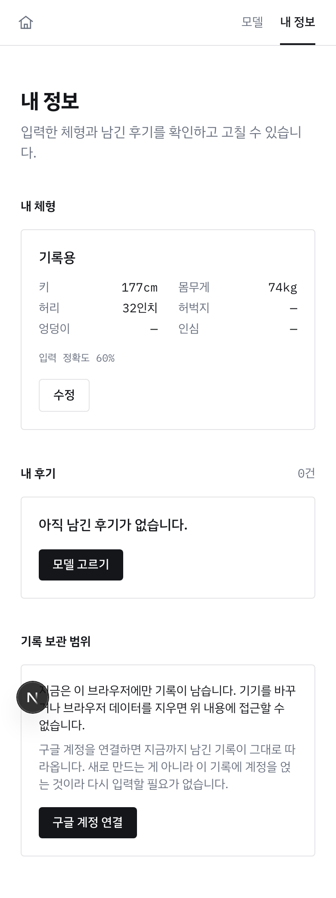

문구는 이득을 먼저 말한다. "로그인하세요"가 아니라 **"지금까지 남긴 기록이 그대로
따라온다"**다. 연결이 선택이므로, 왜 눌러야 하는지가 버튼 옆에 없으면 아무도 누르지 않는다.

### 다시 — 그 설명을 아무도 안 보는 자리에 뒀다

`/me`는 체형과 후기를 다 지나야 나오는 화면의 맨 아래였다. 거기까지 온 사람은 이미
익명으로 후기를 쌓은 뒤라, 연결을 "이득"이 아니라 **"안 하면 잃는다"**로 설명해야 했다.
그래서 문단이 세 개나 붙었고, 그 덩어리가 화면에서 가장 말이 많은 부분이 됐다.

첫 화면으로 옮기니 문장이 짧아진다. 아직 잃을 게 없는 사람에게는 그냥 선택지다.

- `/` = 로그인 화면 — **구글로 시작하기** · **로그인 없이 시작**
- 두 버튼은 같은 크기다. 로그인을 벽으로 만드는 순간 위의 이탈 계산이 그대로 돌아온다
- `/me`에는 상태 한 줄만 남겼다 — `로그인 없이 사용 중 · [구글로 로그인]`

<table>
<tr>
<td>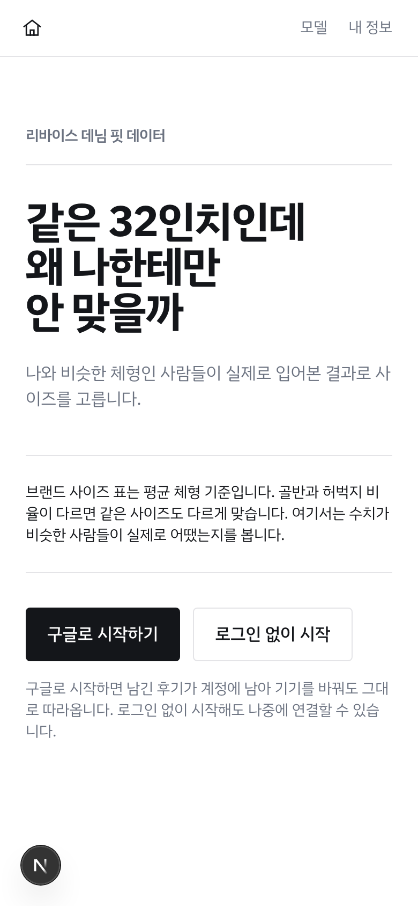</td>
<td>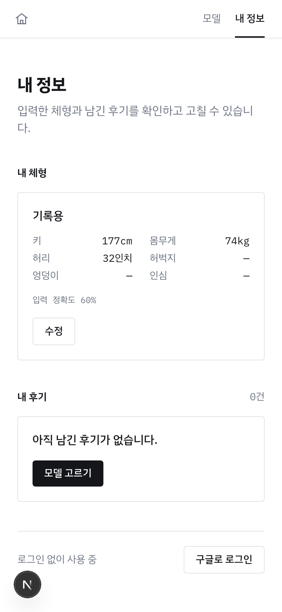</td>
</tr>
</table>

위의 `/me` 화면과 비교하면 설명 세 문단이 한 줄로 줄었다.

**여기서 한 번 틀렸다.** 구글에서 돌아온 사람을 앱 안으로 넘기려고 `SIGNED_IN`
이벤트에 리다이렉트를 걸었는데, 세션이 이미 있으면 **화면을 열 때도** 그 이벤트가 온다.
그래서 로그인 화면을 보러 온 사람이 그대로 튕겨 나갔다. 이벤트가 아니라 **상태가 바뀐
경우**(연결 안 됨 → 연결됨)에만 넘기도록 고쳤다.

### 설정이 꺼져 있는 것을 코드로 잡아냈다

대시보드에서 `Manual linking` 설정을 눈으로 찾지 못해, 연결 API를 직접 호출해봤다.

```json
{ "code": 404, "error_code": "manual_linking_disabled", "msg": "Manual linking is disabled" }
```

켠 뒤 다시 호출하니 구글로 리다이렉트했다. 화면을 헤매는 대신 **응답으로 확인**하는
편이 빨랐고, 무엇이 문제인지도 정확했다.

이 경험을 그대로 코드에 옮겼다 — 설정이 꺼져 있으면 사용자에게
*"Supabase 대시보드에서 Manual linking을 켜세요"*라고 화면에 적힌다.
원문 오류만 보여주면 무엇을 켜야 하는지 알 수 없다.

### 남겨둔 한계

기기 B에서 익명으로 후기를 쓴 상태에서 기기 B에 구글로 로그인하면, 그 후기는
버려지는 익명 계정에 남는다. 연결은 "지금 이 세션"에만 적용된다.
드문 경우라 지금은 감수하고 스펙에 적어뒀다.

---

## 다음 — 외부에 뿌린 뒤

여기까지는 전부 팀 내부에서 만든 것이다. **실사용자 데이터는 아직 0이다.**

에브리타임·인스타 스토리·카톡으로 공유하면서, 채널마다 링크를 다르게 준다.

```
에브리타임  …/team5/?utm_source=everytime
인스타      …/team5/?utm_source=instagram
카톡        …/team5/?utm_source=kakao
```

같은 사이트로 가지만 GA **보고서 → 획득**에서 채널이 갈려 보인다.
"에타가 제일 잘 먹혔다"를 감이 아니라 숫자로 말하기 위해서다. 비용은 0이다.

공유 2~3일 뒤 같은 화면을 다시 찍어 위 기준선과 나란히 놓는다
(`images/ga-after-share.png`). 그 시점이 [검증 기록](../experiments/README.md)의
1차 기록을 쓸 때다.

---

## 아직 안 푼 것

정직하게 남긴다. 해결한 것만 적으면 기록이 아니라 홍보다.

- **실사용자 후기가 0건이다.** 605건이 전부 합성 시드다. 서비스의 핵심 가치가
  "실제 후기"인데 그 후기가 아직 없다
- **모델별 사이즈 보정치가 미검증 추정이다.** 리바이스가 핏별로 공개하는 것은
  밑위·무릎·밑단이지 허벅지 수용치가 아니라, 같은 축의 공식 수치가 없다
- **로그인 없이 시작한 사람은 여전히 기기를 바꾸면 자기 후기를 관리할 수 없다.**
  구글 연결(`linkIdentity`)로 푸는 길은 첫 화면과 `/me` 양쪽에 열어뒀지만, 연결이
  선택인 이상 안 누른 사람에게는 그대로 남는 문제다. 실제로 몇 %가 누르는지는 아직 모른다
- **`findSizeRow`가 죽은 코드다.** export와 테스트만 있고 앱에서 호출되지 않는다

---

## 이 기록에서 반복되는 것

세 번 다 같은 모양이었다.

1. **화면은 멀쩡해 보였다** — 추천도 나오고 경고도 뜨고 GA 코드도 있었다
2. **직접 확인하니 아니었다** — 배포본 HTML을 받아보고, 실제 데이터로 분포를 재고,
   실패해야 하는 경우를 만들어봤다
3. **고친 뒤 다시 확인했다** — 고쳤다는 말이 아니라 고쳐진 것을 봤다

가장 크게 놓칠 뻔한 것(GA)은 **아무 에러도 내지 않고 조용히 꺼져 있던 것**이었다.
시끄럽게 실패하는 버그는 잡힌다. 조용히 실패하는 것이 남는다.
